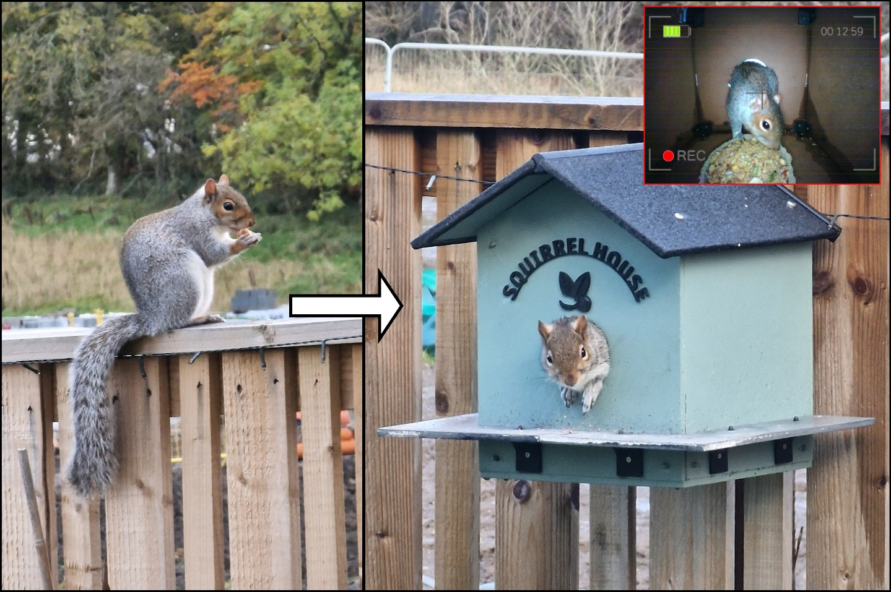
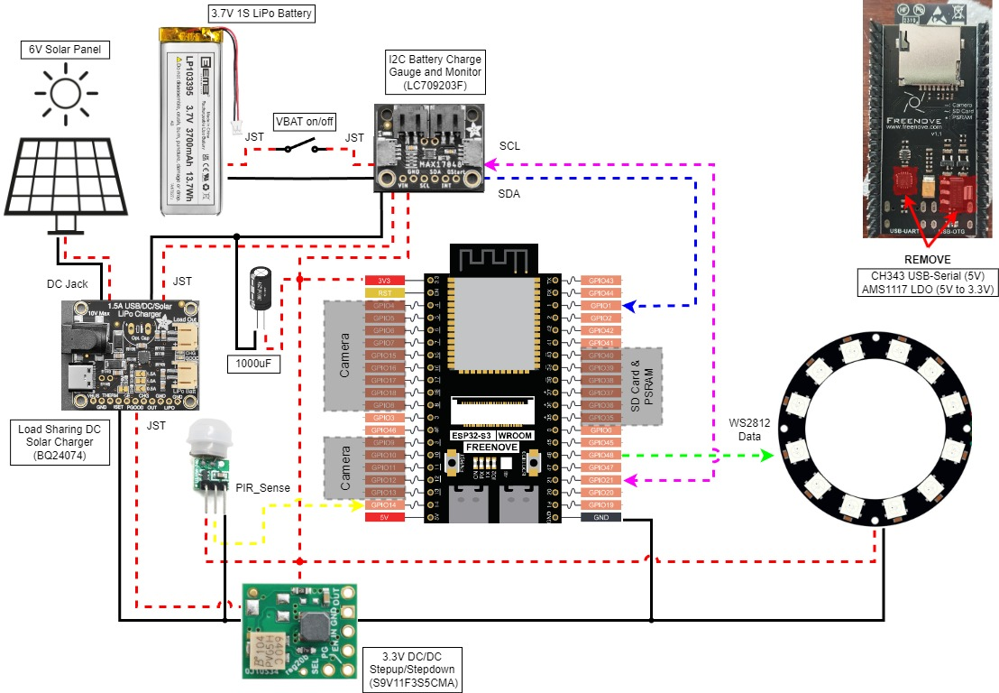

# IOT-Squirrel-House

Custom build for a motion-triggered, video-monitored squirrel feeder. Driven by ESP32 connected to Home Assistant OS.

# See Blog Post for Detailed Build Steps:

https://davidmcdaid.wordpress.com/
